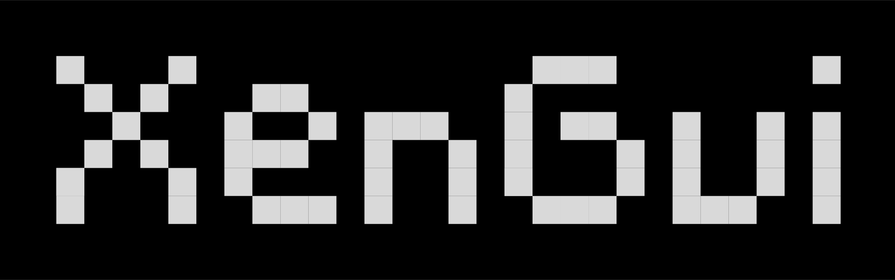

# XenGui: an reactive GUI in pure Rust

[](https://github.com/randseas/xengui)
[](https://github.com/randseas/xengui/blob/main/LICENSE)

<p align="start" style="margin-top: -.5rem">
  <a href="https://xengui.vercel.app">
    
  </a>
</p>

<div align="start" style="margin-top: -1.5rem;text-decoration: underline; text-decoration-color: #4daafc;">

### [Live web demo](https://xengui.vercel.app/demo)

</div>

---

XenGui (pronounced `/ˈzɛn.ɡuː.aɪ/` | `Zen-goo-eye`) is a reactive rendering GUI implementation in pure `Rust` utilizing the `wgpu` graphics API and `winit` window management. The system utilizes a strictly decoupled state-render pipeline bound by a virtual node (`VNode`) trait abstraction.

## Example

```rust
// Virtual nodes are mounted directly to the DOM tree
app.add_node(Box::new());
app.run()?;
```

## Installation

```toml
[dependencies]
xengui = "0.1.0"
```

## Sections:

- [Example](#example)
- [Quick start](#quickstart)
- [Demo](#demo)

## Inspiration

Inspired by [github.com/emilk/egui](https://github.com/emilk/egui)

## License
GNU General Public License v3.0 © 2026 randseas. See [LICENSE](LICENSE) for details.